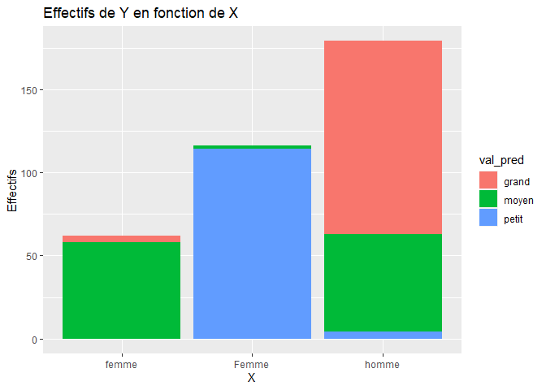
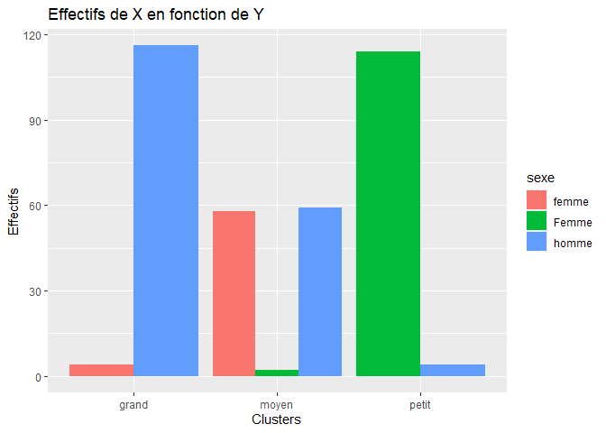
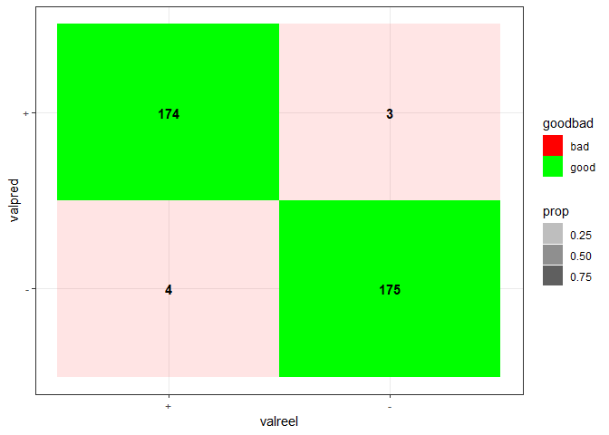
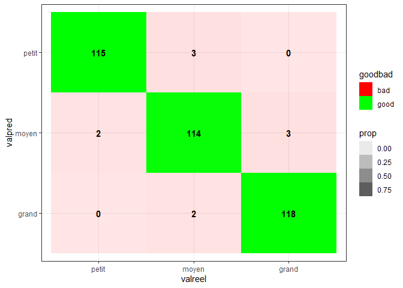
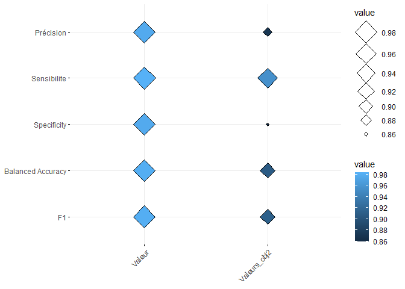

# siseanalytics

siseanalytics is a package to characterize the classes obtained after a
clustering. It makes it possible to characterize the classes in a
univariate way, the variables are taken individually. But also
multivariate. In addition, the pacakge allows to have the evaluation
measures.

In this tutorial we will see the concrete functionality of the package

  - Installation
  - Evaluation metrics
      - Object creation and display
      - Performance indicators
      - Comparaison of clustering results
  - Univariate characterization
  - Multivariate characterization

## Installation

In your script, install the package using these command lines :

``` r
#install.packages("devtools")
library(devtools)
```

    ## Loading required package: usethis

``` r
#install_github("CCCelestine/siseanalytics")
library(siseanalytics)
```

    ## 
    ## Attaching package: 'siseanalytics'

    ## The following object is masked from 'package:graphics':
    ## 
    ##     boxplot

``` r
data(df_test) # data frame test 357 rows and 8 variables
data(pred_reel_3c) # predicted and real values 3 class 
data(pred_reel_2c) # predicted and real values 2 class 
data(pred_reel_2c_bis) # predicted and real values 2 class 
```

## Univariate characterization

### Characterization of the partition

In this part, we assess how each variable contributes to the
constitution of the partition.  
First of all, we will see the case of **qualitative variables**.

``` r
barplotYX(df_test, "sexe", "val_pred")
```

<!-- -->

``` r
barplotXY(df_test, "sexe", "val_pred")
```

<!-- -->

``` r
khi2(df_test$sexe,df_test$val_pred)
```

    ## 
    ##  Pearson's Chi-squared test
    ## 
    ## data:  tableau
    ## X-squared = 427.85, df = 4, p-value < 2.2e-16

``` r
vcramer(df_test$sexe,df_test$val_pred)
```

    ## [1] 0.774098

Next, we will approach the case of **quantitative variables**.

``` r
boxplot(df_test, "val_pred", "taille")
```

<!-- -->

``` r
#tab.quanti(df_test,val_pred)
```

### Characterization of the clusters

We will now compare the clusters with each other.

``` r
data=as.data.frame(df_test[,-c(1,2)])
#resCluster(data,df_test$val_pred,"grand")
```

## Evaluation metrics

### Creating the metrics object

We create 3 objects using the EvalMetrics function. This function takes
as input dataframe containing the real values and the values
predicted by a clustering.

``` r
Obj2c <- EvalMetrics(pred_reel_2c$val_reel,pred_reel_2c$val_pred)
Obj3c <- EvalMetrics(pred_reel_3c$val_reel,pred_reel_3c$val_pred)
Obj2c_bis <- EvalMetrics(pred_reel_2c_bis$val_reel,pred_reel_2c_bis$val_pred)
```

ggMatconf function display the confusion matrix under a ggplot graph

``` r
ggMatConf(Obj2c)
```

<!-- -->

``` r
ggMatConf(Obj3c)
```

<!-- -->

Thanks to the overload of the print method we can display the different
attributes of our object.

``` r
print(Obj2c)
```

    ## [1] "Matrice de confusion et indicateurs"
    ##        valreel
    ## valpred   -   +
    ##       - 175   4
    ##       +   3 174
    ##                       Valeur
    ## Erreur            0.01966292
    ## Accuracy          0.98033708
    ## Précision         0.97765363
    ## Sensibilite       0.98314607
    ## Specificity       0.97752809
    ## Balanced Accuracy 0.98033708
    ## F1                0.98039216

``` r
print(Obj3c)
```

    ## [1] "Matrice de confusion et indicateurs"
    ##        valreel
    ## valpred grand moyen petit
    ##   grand   118     2     0
    ##   moyen     3   114     2
    ##   petit     0     3   115
    ##                       grand     moyen     petit
    ## Erreur            0.0280112 0.0280112 0.0280112
    ## Accuracy          0.9719888 0.9719888 0.9719888
    ## Précision         0.9752066 0.9579832 0.9829060
    ## Sensibilite       0.9833333 0.9579832 0.9745763
    ## Specificity       0.9873418 0.9789916 0.9916318
    ## Balanced Accuracy 0.9853376 0.9684874 0.9831040
    ## F1                0.9792531 0.9579832 0.9787234

### Performance indicators

The package allows to calculate different indicators to evaluate the
results of clustering.

| Indicators        | Details                                                       |
| ----------------- | ------------------------------------------------------------- |
| Erreur            | Overall model performance                                     |
| Accuracy          | Overall model performance (1- erreur)                         |
| Précision         | How accurate positive predictions are                         |
| Sensibilite       | Truly positive observation coverage                           |
| Specificity       | Coverage of truly negative observations                       |
| Balanced Accuracy | Overall performance of the model, when classes are unbalanced |
| F1 score          | Hybrid indicator used for unbalanced classes                  |

### Comparaison of clustering results

Finally in this clustering evaluation part, the pacakge allows you to
compare two clustering results stored in two different objects

``` r
compareRes(Obj2c,Obj2c_bis)
```

<!-- -->

The output will be a ggplot chart confronting the indicators
