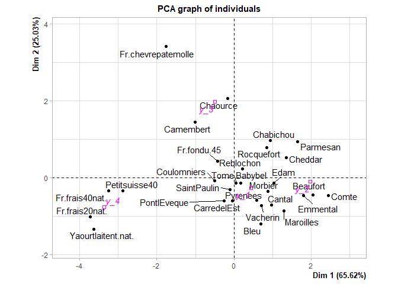

# siseanalytics

siseanalytics is a package to characterize the classes obtained after a
clustering. It makes it possible to characterize the classes in a
univariate way, the variables are taken individually. But also
multivariate. In addition, the pacakge allows to have the evaluation
measures.

In this tutorial we will see the concrete functionality of the package

  - Installation
  - Evaluation metrics
      - Object creation and display
      - Performance indicators
      - Comparaison of clustering results
  - Univariate characterization
      - Characterization of the partition
      - Characterization of clusters
  - Multivariate characterization

## Installation

In your script, install the package using these command lines :

``` r
#install.packages("devtools")
library(devtools)
```

    ## Loading required package: usethis

``` r
#install_github("CCCelestine/siseanalytics")
library(siseanalytics)
```

    ## 
    ## Attaching package: 'siseanalytics'

    ## The following object is masked from 'package:graphics':
    ## 
    ##     boxplot

Access to datasets :

``` r
data(df_test) # data frame test 357 rows and 8 variables
data(pred_reel_3c) # predicted and real values 3 class 
data(pred_reel_2c) # predicted and real values 2 class 
data(pred_reel_2c_bis) # predicted and real values 2 class 
```

## Univariate characterization

### Characterization of the partition

In this part, we assess how each variable contributes to the
constitution of the partition.  
First of all, we will see the case of **qualitative variables**.  
Barplot is a graph that shows categorical variables with rectangular
bars with heights or lengths proportional to the values they represent.
We can see in this first graph how the numbers of our categorical
variable (here the sex) are distributed among the clusters (here small /
medium / large).

``` r
barplotYX(df_test, "sexe", "val_pred")
```

<!-- --> In this
second barplot, we can see how the numbers of clusters are distributed
among the categories of the categorical variable.

``` r
barplotXY(df_test, "sexe", "val_pred")
```

<!-- -->

Since we are in the presence of two categorical variables (the cluster
variable is one), we can create a contingency table between both. This
table provides a first approach to the composition of clusters.
tab.quanti.line() and tab.quanti.col() functions are used to display the
contingency tables in percentage. The calculation of the proportions is
made either in rows or in columns.

``` r
tab.quali.ligne(df_test$val_pred,df_test$sexe)
```

    ##            grand     moyen      petit Total Effectif
    ## femme 0.02247191 0.3370787 0.64044944     1      178
    ## homme 0.64804469 0.3296089 0.02234637     1      179
    ## Sum   0.33613445 0.3333333 0.33053221     1      357

``` r
tab.quali.col(df_test$val_pred,df_test$sexe)
```

    ##                 grand       moyen        petit         Sum
    ## femme      0.03333333   0.5042017   0.96610169   0.4985994
    ## homme      0.96666667   0.4957983   0.03389831   0.5014006
    ## Total      1.00000000   1.0000000   1.00000000   1.0000000
    ## Effectif 120.00000000 119.0000000 118.00000000 357.0000000

We can also perform a Chi-Square Independence Test as well as calculate
Cramer’s V, which is a measure derived from Chi-Square. These results
allow us to know if the two variables are related. Regarding Chi-square,
the p-value must be less than alpha (often 5%) to be able to affirm that
the variables are dependent. As for Cramer’s V, 0 means no liaison and 1
means perfect liaison.

``` r
khi2(df_test$sexe,df_test$val_pred)
```

    ## 
    ##  Pearson's Chi-squared test
    ## 
    ## data:  tableau
    ## X-squared = 207.08, df = 2, p-value < 2.2e-16

``` r
vcramer(df_test$sexe,df_test$val_pred)
```

    ## [1] 0.7616195

Next, we will approach the case of **quantitative variables**.

The boxplot summarizes indicators of the position of the studied
variable (median, quartiles, minimum, maximum or deciles). This plot is
mainly used to compare the same variable in several populations. Here we
will compare the size of people in our three clusters.

``` r
boxplot(df_test, "val_pred", "taille")
```

<!-- -->

In this table, we find the means by variable and by cluster, called the
conditional means. The eta indicator indicates the proportion of
variance explained by the clusters.

``` r
df_test=as.data.frame(df_test)
data_quanti=df_test[,3:5]
tab.quanti(data_quanti,df_test$val_pred)
```

    ##              grand     moyen     petit      eta
    ## taille   192.55833 170.22689 150.86441 88.14153
    ## poids     84.70833  66.85714  46.31356 65.87357
    ## pointure  46.88333  39.47899  36.47458 72.29326

### Characterization of the clusters

We will now compare the clusters with each other.

The resCluster () function displays a summary of the different
indicators for a cluster. First, there is the proportion of individuals
who are part of this cluster among all individuals. Then, there are two
tables : one for the quantitative variables and one for the qualitative
variables. The first compares the mean of a variable for a cluster and
the overall mean, while the other compares the proportion of a variable
in a cluster and the proportion in the overall population. Both tables
have another indicator : the test value. It makes it possible to
distinguish the important variables in the interpretation of clusters.

``` r
data=as.data.frame(df_test[,-c(1,2)])
resCluster(data,df_test$val_pred,"grand")
```

    ## [1] "Caracterisation du cluster k = grand"
    ## [1] "33.61 % de la population"
    ## [1] "Variables quantitatives"
    ##          test_value     group   overall
    ## poids     -8.135136  84.70833  66.06723
    ## pointure -65.319893  46.88333  40.97479
    ## taille   -89.908924 192.55833 171.33333
    ## [1] "Variables qualitatives"
    ##                  test_value   group % overall %
    ## val_parent$grand  13.986667 37.815126 88.333333
    ## sexe$homme        12.493225 50.140056 96.666667
    ## sport$volley       7.735522  7.843137 23.333333
    ## sport$basket       6.795126  6.162465 18.333333
    ## sport$foot         6.739522 33.053221 56.666667
    ## val_parent$moyen  -4.817785 27.731092 11.666667
    ## sport$tennis      -5.175690 15.686275  1.666667
    ## val_parent$petit  -9.733882 34.453782  0.000000
    ## sport$gym        -10.345304 37.254902  0.000000
    ## sexe$femme       -12.493225 49.859944  3.333333

## Evaluation metrics

### Creating the metrics object

We create 3 objects using the EvalMetrics function. This function takes
as input dataframe containing the real values and the values predicted
by a clustering.

``` r
Obj2c <- EvalMetrics(pred_reel_2c$val_reel,pred_reel_2c$val_pred)
Obj3c <- EvalMetrics(pred_reel_3c$val_reel,pred_reel_3c$val_pred)
Obj2c_bis <- EvalMetrics(pred_reel_2c_bis$val_reel,pred_reel_2c_bis$val_pred)
```

ggMatconf function display the confusion matrix under a ggplot graph

``` r
ggMatConf(Obj2c)
```

<!-- -->

``` r
ggMatConf(Obj3c)
```

<!-- -->

Thanks to the overload of the print method we can display the different
attributes of our object.

``` r
print(Obj2c)
```

    ## [1] "Matrice de confusion et indicateurs"
    ##        valreel
    ## valpred   -   +
    ##       - 175   4
    ##       +   3 174
    ##                       Valeur
    ## Erreur            0.01966292
    ## Accuracy          0.98033708
    ## Précision         0.97765363
    ## Sensibilite       0.98314607
    ## Specificity       0.97752809
    ## Balanced Accuracy 0.98033708
    ## F1                0.98039216

``` r
print(Obj3c)
```

    ## [1] "Matrice de confusion et indicateurs"
    ##        valreel
    ## valpred grand moyen petit
    ##   grand   118     2     0
    ##   moyen     3   114     2
    ##   petit     0     3   115
    ##                       grand     moyen     petit
    ## Erreur            0.0280112 0.0280112 0.0280112
    ## Accuracy          0.9719888 0.9719888 0.9719888
    ## Précision         0.9752066 0.9579832 0.9829060
    ## Sensibilite       0.9833333 0.9579832 0.9745763
    ## Specificity       0.9873418 0.9789916 0.9916318
    ## Balanced Accuracy 0.9853376 0.9684874 0.9831040
    ## F1                0.9792531 0.9579832 0.9787234

### Performance indicators

The package allows to calculate different indicators to evaluate the
results of clustering.

| Indicators        | Details                                                       |
| ----------------- | ------------------------------------------------------------- |
| Erreur            | Overall model performance                                     |
| Accuracy          | Overall model performance (1- erreur)                         |
| Précision         | How accurate positive predictions are                         |
| Sensibilite       | Truly positive observation coverage                           |
| Specificity       | Coverage of truly negative observations                       |
| Balanced Accuracy | Overall performance of the model, when classes are unbalanced |
| F1 score          | Hybrid indicator used for unbalanced classes                  |

### Comparaison of clustering results

Finally in this clustering evaluation part, the pacakge allows you to
compare two clustering results stored in two different objects

``` r
compareRes(Obj2c,Obj2c_bis)
```

<!-- -->

The output will be a ggplot chart confronting the indicators
